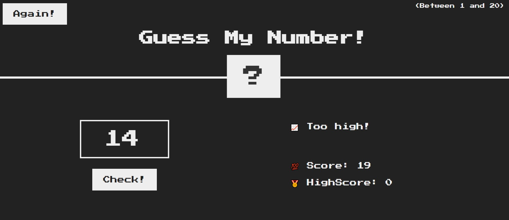

# 🎯 Guess My Number ([Play Now](https://yuvrajrawat14.github.io/GuessMyNumber/))

Welcome to **Guess My Number!** This is a fun and interactive game where the goal is simple: guess the correct number between **1 and 20** based on the hints provided. The game tracks your score and the highest score achieved. Let's see how sharp your guessing skills are!

## 📸 Screenshots

**Gameplay:** Here's a quick snapshot of how the game looks in action!

## 🚀 Features

- 🔢 **Random number generation** between 1 and 20.
- 👇 **Provides feedback** if your guess is too low or too high.
- 📈 **Tracks your current score** and displays the high score.
- 🎮 **Simple and intuitive UI** built using **HTML**, **CSS**, and **JavaScript**.

## 🎮 How to Play

1. Enter your guess in the input field.
2. Based on the feedback, adjust your guess:
   - If the hint says **"Too low"**, try a higher number.
   - If the hint says **"Too high"**, try a lower number.
3. Keep guessing until you find the right number!
4. Your score decreases with each incorrect guess, so guess wisely!
5. You can play again by clicking on the **"Again"** button.

## 🛠️ Built With

- **HTML** for the game structure
- **CSS** for styling and layout
- **JavaScript** for the game logic and interaction
